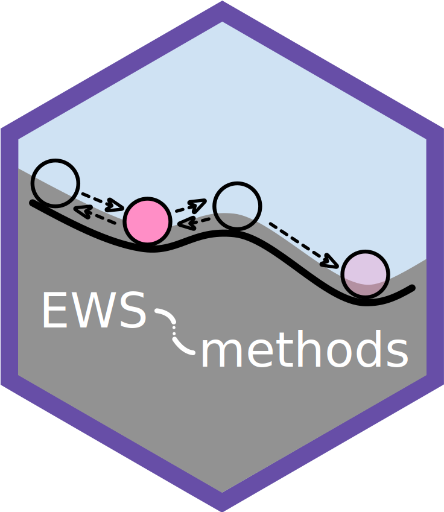

<!-- README.md is generated from README.Rmd. Please edit that file -->

```{r, include = FALSE}
library(rmarkdown)
knitr::opts_chunk$set(
  collapse = TRUE,
  comment = "#>",
  fig.path = "man/figures/README-",
  out.width = "100%"
)
#devtools::build_readme() 
```

# EWSmethods <a href="https://duncanobrien.github.io/EWSmethods/"></a>

<!-- badges: start -->

[](https://zenodo.org/badge/latestdoi/462774077)

[](https://github.com/duncanobrien/EWSmethods/actions)

<!-- badges: end -->

`EWSmethods` is a user friendly interface to various methods of performing Early Warning Signal (EWS) assessments. This R package allows the user to input univariate or multivariate data and perform either traditional rolling window (e.g. Dakos *et al.* 2012) or expanding window (Drake and Griffin, 2010) EWS approaches. Publication standard and ggplot inspired figures can also be generated during this process. `EWSmethods` also provides an R interface to [**EWSNet**](https://ewsnet.github.io), a deep learning modelling framework for predicting critical transitions (Deb *et al.* 2022).

<br>

## Installation
You can install the stable version of `EWSmethods` from [CRAN](https://cran.r-project.org) with:

```{r, eval=F}
install.packages("EWSmethods")
```

Alternatively, you can install the development version  from [GitHub](https://github.com/duncanobrien/EWSmethods) with:

```{r, eval=F}
install.packages("devtools")
devtools::install_github("duncanobrien/EWSmethods", dependencies = TRUE)
```

> ⚠️ **Warning!** - 
> *Due to the large file size of the EWSNet model weights (\~220MB), `EWSmethods` does not come bundled with them. Users must download weights using `ewsnet_reset()` before interfacing with EWSNet.*

<br>

## Getting Started

```{r, message=FALSE}
library(EWSmethods)
```

The remainder of this page will introduce the two primary ways of interacting with `EWSmethods` for your critical transition forecasting needs. For specific function help, please refer to the [Reference](https://duncanobrien.github.io/EWSmethods/reference/index.html) page.

<br>

## 1. Early Warning Signals

Early warning signals are a collection of summary statistics that attempt to characterise the phenomenon of **critical slowing down (CSD)**. As a system approaches a tipping point (or bifurcation), it takes longer and longer for it to recover when it is pushed away from stability (Dakos *et al.* 2012). This increased **return rate** is a manifestation of CSD and can be detectable in data. `EWSmethods` provides a collection of these summary statistics which can be calculated from either univariate or multivariate time series using `uniEWS()` and `multiEWS()` respectively.

<br>

### The univariate approach

Imagine we have 50 years of monitoring data for a local population of skylarks (*Alauda arvensis*) and have measured mean body mass data throughout this period as well.

We could calculate either rolling or expanding window EWSs using the abundance data via `uniEWS()` but decide to initially focus on rolling windows. We would therefore parameterise the function to do so as below:

```{r roll_example, fig.keep = "none"}
set.seed(125) #seed to ensure reproducible results

skylark_data <- data.frame(time = seq(1:50), abundance = rnorm(50,mean = 100,sd=20), trait = rnorm(50,mean=40,sd=5)) #dummy skylark dataset

ews_metrics <- c("SD","ar1","skew") #the early warning signal metrics we wish to compute

roll_ews <- uniEWS(data = skylark_data[,1:2], metrics =  ews_metrics, method = "rolling", winsize = 50) #lets use a rolling window approach

roll_ews$EWS$cor #return the Kendall Tau correlations for each EWS metric
```

We can then use the resulting figures to identify oncoming transitions. In this case, we expect no transition as the data is randomly sampled from a normal distribution and this is evident in the Kendall Tau values, with no strong positive correlation with time:

```{r rolling_plot, dpi=144}
plot(roll_ews,  y_lab = "Skylark abundance")
```

Alternatively, we may be more interested in expanding windows as that approach standardises the changing EWS metrics over time and therefore allows the strength of multiple signals to be combined. We could achieve this using the following code:

```{r _expand_example, fig.keep = "none"}
exp_ews <- uniEWS(data = skylark_data[,1:2], metrics =  ews_metrics, method = "expanding", burn_in = 10, threshold = 2,  tail.direction = "one.tailed") #lets use a rolling window approach

head(exp_ews$EWS) #return the head of the EWS dataframe
```

And again, we can then use the resulting figures to identify oncoming transitions. Whilst we have some trangressions of the 2σ threshold, we only consider these signals "warnings" if two or more consecutive signals are identified (Clements *et al.* 2019).

```{r expanding_plot, dpi=144}
plot(exp_ews, y_lab = "Skylark abundance")
```

A second benefit of the expanding window approach is that additional information can be used to improve the reliability of the assessment. Including trait information has been shown to decrease the likelihood of both false positive and false negative signals (Clements and Ozgul, 2016; Baruah *et al.* 2019) and therefore should be considered if possible.

For example, in our hypothetical skylark dataset, we have measured average population body mass. This data can then be delivered to the `univariate_EWS_wrapper()` function in `EWSmethods`, using the `trait` argument.

```{r expand_trait_example, fig.keep = "none"}
trait_metrics <- c("SD", "ar1", "trait")

exp_ews_trait <- uniEWS(data = skylark_data[,1:2], metrics =  trait_metrics, trait = skylark_data$trait, method = "expanding", burn_in = 10, threshold = 2, tail.direction = "one.tailed")
```

```{r expanding_plot_trait, dpi=144}
plot(exp_ews_trait, y_lab = "Skylark abundance", trait_lab = "Body mass (g)", trait_scale = 5)
```

<br>

### The multivariate approach

If we had data from multiple timeseries/measurements of the same system, we might be interested in multivariate early warning signals. These indicators exploit either dimension reduction techniques (such as Principal Component Analysis) or community average estimates to give an overall measure of system resilience (see Weinans *et al.* 2021 for an overview of each indicator).

Here we've constructed another hypothetical dataset representing five related populations of Caribbean reef octopus (*Octopus briareus*) in Bahamian salt water lakes (O'Brien *et al.* 2020) and are interested in assessing the resilience of this metapopulation. The following code shows how we would achieve this using the `EWSmethods` function `multiEWS()`.

```{r multivariate_example, fig.keep = "none"}
set.seed(123)

octopus_spp_data <- matrix(nrow = 50, ncol = 5)
octopus_spp_data <- as.data.frame(cbind("time"=seq(1:50),sapply(1:dim(octopus_spp_data)[2], function(x){octopus_spp_data[,x] <- rnorm(50,mean=500,sd=200)}))) #create our hypothetical, uncollapsing ecosystem

oct_exp_ews <- multiEWS(data = octopus_spp_data, method = "expanding", threshold = 2, tail.direction = "one.tailed") #lets use an expanding window approach
```

The figure again shows that one multivariate EWS indicator has expressed a warning, but that overall, no transition is anticipated.

```{r expanding_oct_plot, dpi=144, fig.height=6}
plot(oct_exp_ews)
```

<br>

## 2. EWSNet

The other half of `EWSmethods` allows you to query the [Python-based](https://www.python.org) **EWSNet** via an easy to use R workflow. Here is a simple example that details how to first prepare your R session to communicate with Python (using the excellent `reticulate` [R package](https://rstudio.github.io/reticulate/)) and then calls **EWSNet** to assess the probability of a transition occurring in the skylark time series. This is a two step process where we must a) call `ewsnet_init()` before b) using `ewsnet_predict()`.

However, because this is the first time using EWSNet via `EWSmethods`, we must first download the pretrained model weights from [https://ewsnet.github.io](https://ewsnet.github.io).

```{r ewsnet_prep, warning = FALSE}
ewsnet_reset(remove_weights = FALSE, auto = T)
```

Now we can setup our R session and interface with EWSNet.

```{r ewsnet, warning = FALSE}
ewsnet_init(envname = "EWSNET_env", auto = T) #prepares your workspace using 'reticulate' and asks to install Anaconda (if no appropriate Python found) and/or a Python environment before activating that environment with the necessary Python packages

library(reticulate)

reticulate::py_config() #confirm that "EWSNET_env" has been loaded

py_packages <- reticulate::py_list_packages() #list all packages currently loaded in to "EWSNET_env"
head(py_packages)

skylark_ewsnet <- ewsnet_predict(skylark_data$abundance, scaling = TRUE, ensemble = 25, envname = "EWSNET_env") #perform EWSNet assessment using white noise and all 25 models. The envname should match ewsnet_init()

skylark_ewsnet
```

<br>

## References

Baruah, G., Clements, C.F., Guillaume, F. & Ozgul, A. (2019) When do shifts in trait dynamics precede population declines? *The American Naturalist*, 193, 633--644. [doi:10.1086/702849](https://www.journals.uchicago.edu/doi/10.1086/702849)

Clements, C.F. & Ozgul, A. (2016) Including trait-based early warning signals helps predict population collapse. *Nature Communications*, 7, 10984. [doi:10.1038/ncomms10984](https://www.nature.com/articles/ncomms10984)

Clements, C.F., McCarthy, M.A. & Blanchard, J.L. (2019) Early warning signals of recovery in complex systems. *Nature Communications*, 10, 1681. [doi:10.1038/s41467-019-09684-y](https://www.nature.com/articles/s41467-019-09684-y)

Dakos V., Carpenter S.R., Brock W.A., Ellison A.M., Guttal V., *et al.* (2012) Methods for detecting early warnings of critical transitions in time series illustrated using simulated ecological data. *PLOS ONE*, 7, 7:e41010. [doi:10.1371/journal.pone.0041010](https://journals.plos.org/plosone/article?id=10.1371/journal.pone.0041010)

Deb S., Sidheekh S., Clements C.F., Krishnan N.C. & Dutta P.S. (2022) Machine learning methods trained on simple models can predict critical transitions in complex natural systems. *Royal Society Open Science*, 9, 211475. [doi:10.1098/rsos.211475](https://royalsocietypublishing.org/doi/10.1098/rsos.211475)

Drake, J. & Griffen, B. (2010) Early warning signals of extinction in deteriorating environments. *Nature*, 467, 456--459. [doi:10.1038/nature09389](https://www.nature.com/articles/nature09389)

O'Brien, D.A., Taylor, M.L., Masonjones, H.D., Boersch-Supan P.H. & O'Shea, O.R. (2020) Drivers of octopus abundance and density in an anchialine lake: a 30 year comparison. *Journal of Experimental Marine Biology and Ecology*, 528, 151377. [doi:10.1016/j.jembe.2020.151377](https://www.sciencedirect.com/science/article/pii/S0022098120300356)

Weinans, E., Quax, R., van Nes, E.H. & van de Leemput, I.A. (2021) Evaluating the performance of multivariate indicators of resilience loss. *Scientific Reports*, 11, 9148. [10.1038/s41598-021-87839-y](https://www.nature.com/articles/s41598-021-87839-y)
