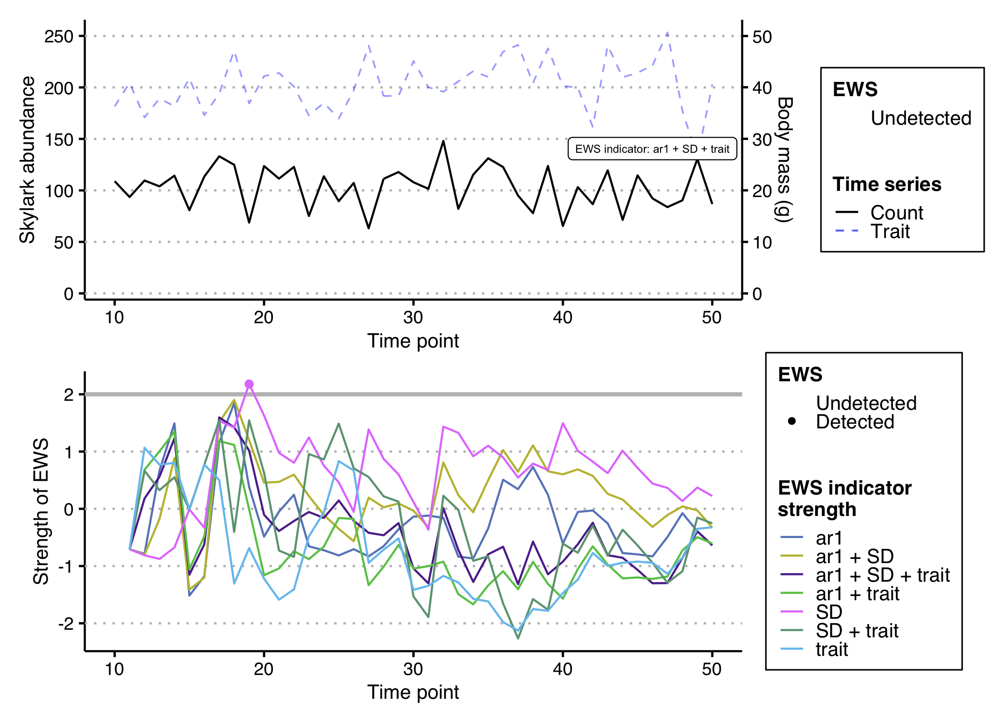
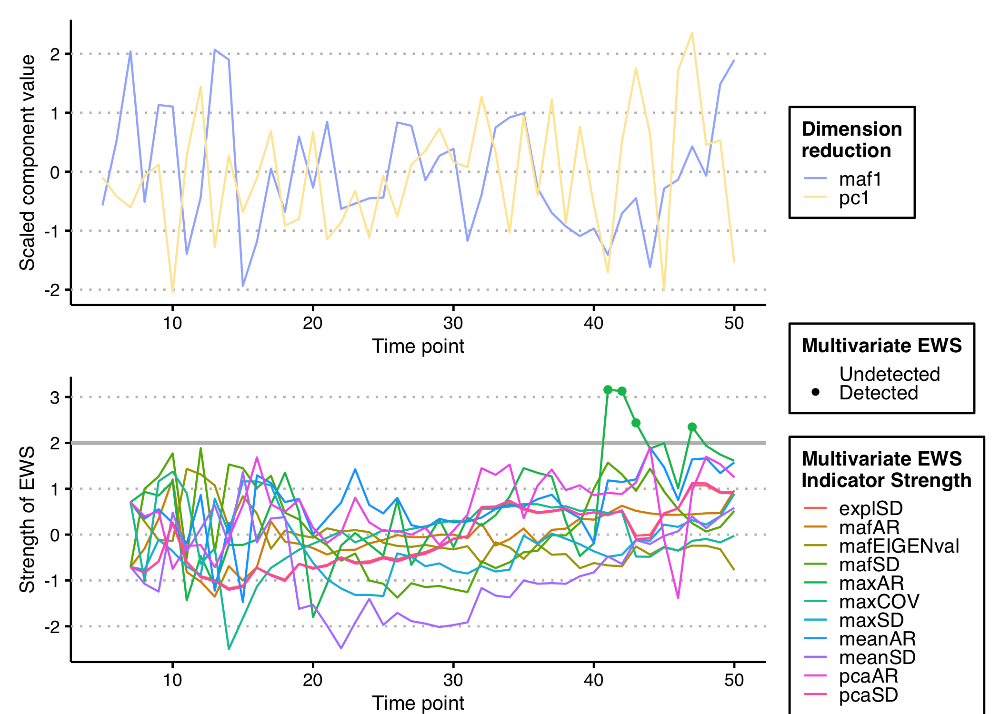

<!-- README.md is generated from README.Rmd. Please edit that file -->

# EWSmethods

<!-- badges: start -->
<!-- badges: end -->

`EWSmethods` is a user friendly interface to various methods of
performing Early Warning Signal (EWS) assessments. This R package allows
the user to input univariate or multivariate data and perform either
traditional rolling window (e.g. Dakos *et al.* 2012) or expanding
window (Drake and Griffin, 2010) EWS approaches. Publication standard
and ggplot inspired figures can also be generated during this process.
`EWSmethods` also provides an R interface to
[**EWSNET**](https://ewsnet.github.io), a deep learning modelling
framework for predicting critical transitions (Deb *et al.* 2022).

## Installation

You can install the development version of `EWSmethods` from
[GitHub](https://github.com/duncanobrien/EWSmethods) with:

``` r
# install.packages("devtools")
# devtools::install_github("duncanobrien/EWSmethods")
```

## Examples

Imagine we have 50 years of monitoring data for a local population of
skylarks (*Alauda arvensis*) as well as mean body mass data. We could
calculate either rolling or expanding window EWSs for the abundance data
and would do so using `EWSmethods` as below:

``` r
library(EWSmethods)
set.seed(125) #seed to ensure reproducible results

skylark_data <- data.frame(time = seq(1:50), abundance = rnorm(50,mean = 100,sd=20), trait = rnorm(50,mean=40,sd=5)) #dummy skylark dataset

ews_metrics <- c("SD","ar1","skew") #the early warning signal metrics we wish to compute

roll_ews <- univariate_EWS_wrapper(data = skylark_data[,1:2],metrics =  ews_metrics,method = "rolling",winsize = 50, ggplotIt =TRUE, y_lab = "Skylark abundance") #lets use a rolling window approach

print(roll_ews$EWS$cor) #return the Kendall Tau correlations for each EWS metric
#>            SD        ar1       skew
#> tau 0.5446154 -0.3907692 -0.7046154
```

We can then use the resulting figures to identify oncoming transitions.
In this case, we expect no transition as the data is randomly sampled
from a normal distribution and this is evident in the Kendall Tau
values, with no strong positive correlation with time:


Alternatively, we may be more interested in expanding windows as that
approach standardises the changing EWS metrics over time and therefore
allows the strength of multiple signals to be combined. We could achieve
this using the following code:

``` r
exp_ews <- univariate_EWS_wrapper(data = skylark_data[,1:2],metrics =  ews_metrics,method = "expanding",burn_in = 10, threshold = 2, tail.direction = "one.tailed", ggplotIt =TRUE, y_lab = "Skylark abundance") #lets use a rolling window approach
#> Warning: Removed 7 row(s) containing missing values (geom_path).
#> Warning: Removed 7 rows containing missing values (geom_point).

head(exp_ews$EWS) #return the head of the EWS dataframe
#>   time metric.score metric.code rolling.mean rolling.sd threshold.crossed
#> 1   10    0.0000000         ar1    0.0000000         NA                 0
#> 2   11   -0.7071068         ar1   -0.3535534  0.5000000                 0
#> 3   12   -0.9223669         ar1   -0.5431579  0.4825449                 0
#> 4   13   -0.1500572         ar1   -0.4448827  0.4403012                 0
#> 5   14    0.8428688         ar1   -0.1873324  0.6906950                 0
#> 6   15   -1.8668306         ar1   -0.4672488  0.9229121                 0
#>   count.used        str
#> 1  108.91249         NA
#> 2   93.56813 -0.7071068
#> 3  109.56960 -0.7858522
#> 4  103.92341  0.6695997
#> 5  114.29655  1.4915428
#> 6   80.79726 -1.5164845
```

And again, we can then use the resulting figures to identify oncoming
transitions. Whilst we have some trangressions of the 2
*σ*
threshold, we only consider these signals “warnings” if two or more
consecutive signals are identified (Clements *et al.* 2019).


A second benefit of the expanding window approach is that additional
information can be used to improve the reliability of the assessment.
Including trait information has been shown to decrease the likelihood of
both false positive and false negative signals (Clements and Ozgul,
2016; Baruah *et al.* 2019) and therefore should be considered if
possible. For example, in our hypothetical skylark dataset, we have
measured average population body mass. This data can then be delivered
to `EWSmethods` using the `trait` argument.

``` r
trait_metrics <- c("SD", "ar1", "trait")
exp_ews_trait <- univariate_EWS_wrapper(data = skylark_data[,1:2],metrics =  trait_metrics,method = "expanding",burn_in = 10, threshold = 2, tail.direction = "one.tailed", ggplotIt =TRUE, y_lab = "Skylark abundance",
trait = skylark_data$trait, trait_lab = "Body mass (g)", trait_scale = 5)
#> Warning: Removed 7 row(s) containing missing values (geom_path).
#> Warning: Removed 7 rows containing missing values (geom_point).
```



### Multivariate Early Warning Signals

If we had data from multiple timeseries/measurements of the same system,
we might be interested in multivariate early warning signals. These
indicators exploit either dimension reduction techniques (such as
Principal Component Analysis) or community average estimates to give an
overall measure of system resilience (see Weinans *et al.* 2021 for an
overview of each indicator). Here we’ve constructed another hypothetical
dataset representing five related populations of Caribbean reef octopus
(*Octopus briareus*) in Bahamian salt water lakes (O’Brien *et al.*
2020) and are interested in assessing the resilience of this
metapopulation. The following code shows how we would achieve this using
`EWSmethods`.

``` r
set.seed(123)

octopus_spp_data <- matrix(nrow = 50, ncol = 5)
octopus_spp_data <- as.data.frame(cbind("time"=seq(1:50),sapply(1:dim(octopus_spp_data)[2], function(x){octopus_spp_data[,x] <- rnorm(50,mean=500,sd=200)}))) #create our hypothetical, uncollapsing ecosystem

oct_exp_ews <- multivariate_EWS_wrapper(data = octopus_spp_data,method = "expanding",threshold = 2, tail.direction = "one.tailed",ggplotIt = TRUE) #lets use an expanding window approach
#> Warning: Removed 22 row(s) containing missing values (geom_path).
#> Warning: Removed 22 rows containing missing values (geom_point).
```

The figure again shows that one multivariate EWS indicator has expressed
a warning, but that overall, no transition is anticipated…


## EWSNet

The other half of `EWSmethods` allows you to use the
[Python-based](https://www.python.org) **EWSNet** via an easy to use R
workflow. Here is a simple example that details how to first prepare
your R session to communicate with Python (using the excellent
`reticulate` [R package](https://rstudio.github.io/reticulate/)) and
then calls **EWSNet** to assess the probability of a transition
occurring in the skylark time series. This is a two step process where
we must a) call `ewsnet_init()` before b) using `ewsnet_predict()`.

``` r
library(reticulate)

ewsnet_init(envname = "EWSNET_env") #prepares your workspace using 'reticulate' and asks to install Anaconda (if no appropriate Python found) and/or a Python environment before activating that environment with the necessary Python packages
#> conda env EWSNET_env found. Would you like to activate it and install necessary
#> packages? (y/n)
#> Aborting

print(reticulate::py_config()) #confirm that "EWSNET_env" has been loaded
#> python:         /opt/miniconda3/envs/EWSNET_env/bin/python3
#> libpython:      /opt/miniconda3/envs/EWSNET_env/lib/libpython3.8.dylib
#> pythonhome:     /opt/miniconda3/envs/EWSNET_env:/opt/miniconda3/envs/EWSNET_env
#> version:        3.8.12 | packaged by conda-forge | (default, Jan 30 2022, 23:33:09)  [Clang 11.1.0 ]
#> numpy:          /opt/miniconda3/envs/EWSNET_env/lib/python3.8/site-packages/numpy
#> numpy_version:  1.22.2
#> 
#> python versions found: 
#>  /opt/miniconda3/envs/EWSNET_env/bin/python3
#>  /opt/miniconda3/bin/python

skylark_ewsnet <- ewsnet_predict(skylark_data$abundance, noise_type = "W", ensemble = 25, envname = "EWSNET_env") #perform EWSNet assessment using white noise and all 25 models. The envname should match ewsnet_init()

print(skylark_ewsnet)
#>            pred no_trans_prob smooth_trans_prob critical_trans_prob
#> 1 No Transition     0.3599662          0.240019           0.4000148
```

## References

Baruah, G., Clements, C.F., Guillaume, F. & Ozgul, A. (2019) When do
shifts in trait dynamics precede population declines? *The American
Naturalist*, 193, 633–644.
[doi:10.1086/702849](https://www.journals.uchicago.edu/doi/10.1086/702849)

Clements, C.F. & Ozgul, A. (2016) Including trait-based early warning
signals helps predict population collapse. *Nature Communications*, 7,
10984.
[doi:10.1038/ncomms10984](https://www.nature.com/articles/ncomms10984)

Clements, C.F., McCarthy, M.A. & Blanchard, J.L. (2019) Early warning
signals of recovery in complex systems. *Nature Communications*, 10,
1681.
[doi:10.1038/s41467-019-09684-y](https://www.nature.com/articles/s41467-019-09684-y)

Dakos V., Carpenter S.R., Brock W.A., Ellison A.M., Guttal V., *et al.*
(2012) Methods for detecting early warnings of critical transitions in
time series illustrated using simulated ecological data. *PLOS ONE*, 7,
7:e41010.
[doi:10.1371/journal.pone.0041010](https://journals.plos.org/plosone/article?id=10.1371/journal.pone.0041010)

Deb S., Sidheekh S., Clements C.F., Krishnan N.C. & Dutta P.S. (2022)
Machine learning methods trained on simple models can predict critical
transitions in complex natural systems. *Royal Society Open Science*, 9,
211475.
[doi:10.1098/rsos.211475](https://royalsocietypublishing.org/doi/10.1098/rsos.211475)

Drake, J. & Griffen, B. (2010) Early warning signals of extinction in
deteriorating environments. *Nature*, 467, 456–459.
[doi:10.1038/nature09389](https://www.nature.com/articles/nature09389)

O’Brien, D.A., Taylor, M.L., Masonjones, H.D., Boersch-Supan P.H. &
O’Shea, O.R. (2020) Drivers of octopus abundance and density in an
anchialine lake: a 30 year comparison. *Journal of Experimental Marine
Biology and Ecology*, 528, 151377.
[doi:10.1016/j.jembe.2020.151377](https://www.sciencedirect.com/science/article/pii/S0022098120300356)

Weinans, E., Quax, R., van Nes, E.H. & van de Leemput, I.A. (2021)
Evaluating the performance of multivariate indicators of resilience
loss. *Scientific Reports*, 11, 9148.
[10.1038/s41598-021-87839-y](https://www.nature.com/articles/s41598-021-87839-y)

`devtools::build_readme()`
