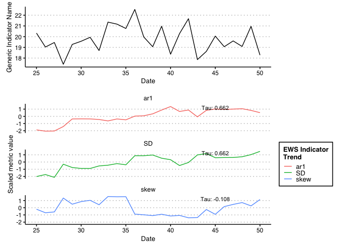
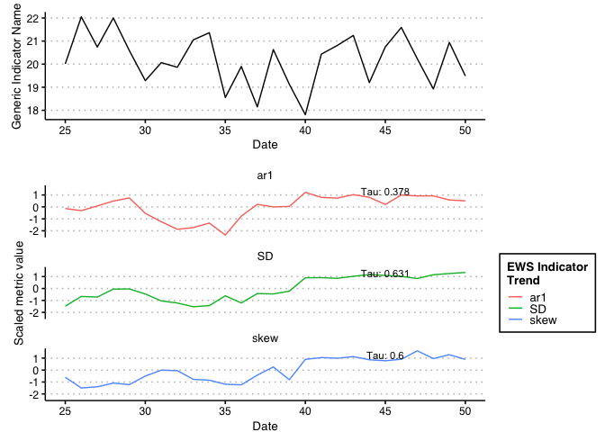

<!-- README.md is generated from README.Rmd. Please edit that file -->

# EWSmethods

<!-- badges: start -->
<!-- badges: end -->

*EWSmethods* is a user friendly interface to various methods of
performing Early Warning Signal (EWS) assessments. This R package allows
the user to input univariate or multivariate data and perform either
traditional rolling window or expanding window EWS approaches.
Publication standard and ggplot inspired figures can also be generated
during this process. *EWSmethods* also provides an R interface to
**EWSNET** ([link](https://ewsnet.github.io)), a deep learning modelling
framework for predicting critical transitions.

## Installation

You can install the development version of EWSmethods from
[GitHub](https://github.com/duncanobrien/EWSmethods) with:

``` r
# install.packages("devtools")
#devtools::install_github("duncanobrien/EWSmethods")
```

## Examples

Imagine we have 50 years of monitoring data for a local population of
skylarks (*Alauda arvensis*) as well as mean body mass data. We could
calculate either rolling or expanding window EWSs for the abundance data
as would do so using EWSmethods as below:

``` r
library(EWSmethods)

skylark_data <- data.frame(time = seq(1:50), abundance = rnorm(50,mean = 20), trait = rnorm(50,mean=40,sd=5)) #dummy skylark dataset

ews_metrics <- c("SD","ar1","skew") #the early warning signal metrics we wish to compute

roll_ews <- univariate_EWS_wrapper(data = skylark_data[,1:2],metrics =  ews_metrics,method = "rolling",winsize = 50, ggplotIt =TRUE) #lets using a rolling window approach
```



``` r
print(roll_ews$EWS$cor) #return the Kendall Tau correlations for each EWS metric
#>            SD       ar1 skew
#> tau 0.6307692 0.3784615  0.6
```


You’ll still need to render `README.Rmd` regularly, to keep `README.md`
up-to-date. `devtools::build_readme()` is handy for this. You could also
use GitHub Actions to re-render `README.Rmd` every time you push. An
example workflow can be found here:
<https://github.com/r-lib/actions/tree/v1/examples>.

You can also embed plots, for example:


In that case, don’t forget to commit and push the resulting figure
files, so they display on GitHub and CRAN.
