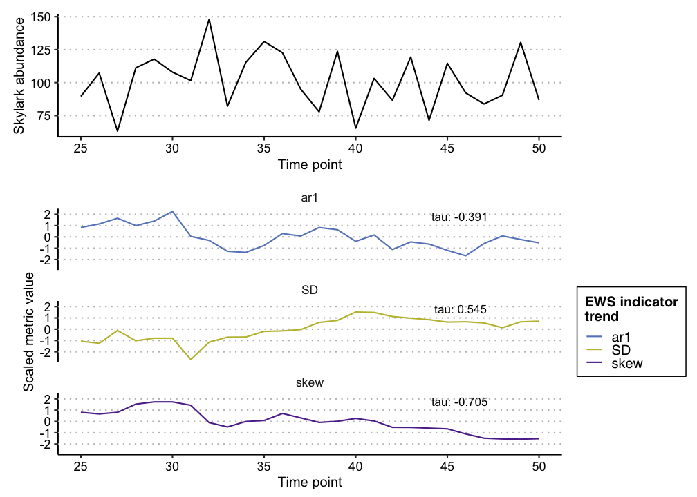

<!-- README.md is generated from README.Rmd. Please edit that file -->

# EWSmethods

<!-- badges: start -->
<!-- badges: end -->

*EWSmethods* is a user friendly interface to various methods of
performing Early Warning Signal (EWS) assessments. This R package allows
the user to input univariate or multivariate data and perform either
traditional rolling window or expanding window EWS approaches.
Publication standard and ggplot inspired figures can also be generated
during this process. *EWSmethods* also provides an R interface to
[**EWSNET**](https://ewsnet.github.io), a deep learning modelling
framework for predicting critical transitions.

## Installation

You can install the development version of EWSmethods from
[GitHub](https://github.com/duncanobrien/EWSmethods) with:

``` r
# install.packages("devtools")
#devtools::install_github("duncanobrien/EWSmethods")
```

## Examples

Imagine we have 50 years of monitoring data for a local population of
skylarks (*Alauda arvensis*) as well as mean body mass data. We could
calculate either rolling or expanding window EWSs for the abundance data
as would do so using EWSmethods as below:

``` r
library(EWSmethods)

skylark_data <- data.frame(time = seq(1:50), abundance = rnorm(50,mean = 100,sd=20), trait = rnorm(50,mean=40,sd=5)) #dummy skylark dataset

ews_metrics <- c("SD","ar1","skew") #the early warning signal metrics we wish to compute

roll_ews <- univariate_EWS_wrapper(data = skylark_data[,1:2],metrics =  ews_metrics,method = "rolling",winsize = 50, ggplotIt =TRUE, y_lab = "Skylark abundance") #lets using a rolling window approach

print(roll_ews$EWS$cor) #return the Kendall Tau correlations for each EWS metric
#>             SD        ar1       skew
#> tau -0.4030769 -0.5076923 0.07692308
```

We can then use the resulting figures to identify oncoming transitions.
In this case, we expect no transition as the data is randomly sampled
from a normal distribution and this is evident in the Kendall Tau
values, with no strong positive correlation with time:


Alternatively, we may be more interested in expanding windows as that
approach standardises the changing EWS metrics over time and therefore
allows the strength of multiple signals to be combined. We could achieve
this using the following code:

``` r
#skylark_data <- data.frame(time = seq(1:50), abundance = rnorm(50,mean = 20), #trait = rnorm(50,mean=40,sd=5)) #dummy skylark dataset

#ews_metrics <- c("SD","ar1","skew") #the early warning signal metrics we wish to compute

exp_ews <- univariate_EWS_wrapper(data = skylark_data[,1:2],metrics =  ews_metrics,method = "expanding",burn_in = 10, threshold = 2, tail.direction = "one.tailed", ggplotIt =TRUE, y_lab = "Skylark abundance") #lets using a rolling window approach
#> Warning: Removed 7 row(s) containing missing values (geom_path).
#> Warning: Removed 7 rows containing missing values (geom_point).

head(exp_ews$EWS) #return the head of the EWS dataframe
#>   time metric.score metric.code rolling.mean rolling.sd threshold.crossed
#> 1   10    0.0000000         ar1   0.00000000         NA                 0
#> 2   11    0.7071068         ar1   0.35355339  0.5000000                 0
#> 3   12    0.9451838         ar1   0.55076354  0.4916051                 0
#> 4   13   -1.4289097         ar1   0.05584523  1.0681262                 0
#> 5   14    1.1794107         ar1   0.28055832  1.0526871                 0
#> 6   15    0.1399835         ar1   0.25712918  0.9432993                 0
#>   count.used        str
#> 1  117.43988         NA
#> 2  110.79322  0.7071068
#> 3  119.21920  0.8023113
#> 4   58.71748 -1.3900557
#> 5   78.16015  0.8538647
#> 6  116.43575 -0.1241872
```

And again, we can then use the resulting figures to identify oncoming
transitions. Whilst we have some trangressions of the 2$threshold, we
only consider these signals “warnings” if two or more consecutive
signals are identified (Clements *et al.* 2019).


You’ll still need to render `README.Rmd` regularly, to keep `README.md`
up-to-date. `devtools::build_readme()` is handy for this. You could also
use GitHub Actions to re-render `README.Rmd` every time you push. An
example workflow can be found here:
<https://github.com/r-lib/actions/tree/v1/examples>.

You can also embed plots, for example:


In that case, don’t forget to commit and push the resulting figure
files, so they display on GitHub and CRAN.
