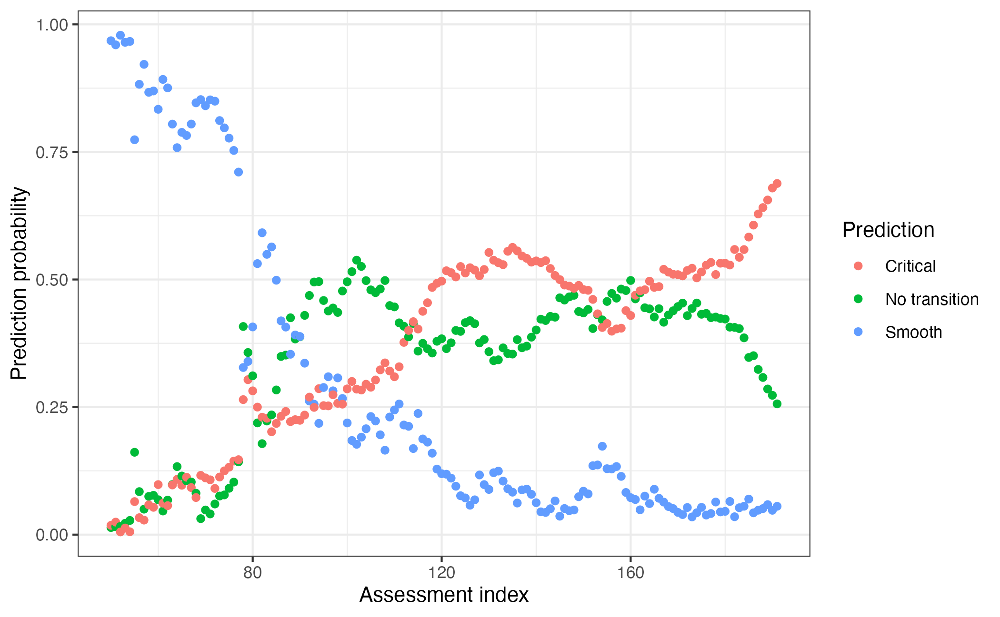

# Using EWSNet

## About this tutorial

This tutorial introduces how to interface with **EWSNet**, a machine
learning model trained to predict critical transitions, tipping points,
and regime shifts (Deb *et al.* 2022). We will only focus on how to set
up your R session to interact with EWSNet and how to interpret the
output rather than the theory and mathematics underlying the model. If
you are interest in those details, please refer to the EWSNet specific
[website and documentation](https://ewsnet.github.io) or the associated
[publication](https://royalsocietypublishing.org/doi/10.1098/rsos.211475).

**NOTE** This version of EWSNet differs from that published by Deb *et
al.* (2022) in that is has been retrained using a range of time series
lengths (minimum = 15). This improves the accuracy of EWSNet over a
range of time series lengths but we recommend that the minimum length to
be tested should be 15 data points.

  

## Getting started

``` r
set.seed(123) #to ensure reproducible data

library(EWSmethods)
library(ggplot2)
```

``` r
options(timeout = max(600, getOption("timeout"))) #due to possible internet issues, increase the timeout options from 60 seconds to 600
```

As EWSNet has been written and developed in Python, for R to interact
with it, we need to exploit the `reticulate` [R
package](https://rstudio.github.io/reticulate/). `reticulate` provides
the tools to run Python code in R and transfer objects between the two
languages but tends to run much smoother in RStudio rather than base R.
It is therefore recommended that you use the [RStudio
IDE](https://posit.co/download/rstudio-desktop) when using the EWSNet
portion of `EWSmethods`.

The following sections will show how to setup and run EWSNet in
`EWSmethods` before troubleshooting a few common errors stemming from
the Python-`reticulate`-R interface.

  

### 1. Initialising **EWSNet**

Rather than requiring the user to learn `reticulate` and setup the R
session themselves, `EWSmethods` provides a single function capable of
checking your machine for Python, installing it if it’s not found (along
with the critical packages), creating a new Python environment to hold
these packages, and then activating that environment when ready. To
prevent the user accidentally installing Python or packages, the
function does require confirmation inputs from the user and so needs to
be run **at the start of any new R session**.

For example, to create a new Python environment called `"EWSNET_env"`
and install Python, the function would be written as below. The
environment name (`"EWSNET_env"`) will be critical to running the later
functions.

``` r
#prepares your session using 'reticulate' and asks to install Anaconda (if no appropriate Python found) and/or a Python environment before activating that environment with the necessary Python packages
ewsnet_init(envname = "EWSNET_env", pip_ignore_installed = FALSE)
```

    #> Error : Specified conda binary '/home/runner/.local/share/r-miniconda/bin/conda' does not exist.

If successful, you will have had to input `"y"` to allow `EWSmethods` to
download and activate the Python environment and now see the message
`"EWSNET_env successfully found and activated. Necessary Python packages installed"`).
If not, please refer to the Troubleshooting section at the end of the
tutorial.

To double check the environment activation, you could use `reticulate`
functions to check first what environment is active and second what
Python packages have been loaded:

``` r
library(reticulate)

#print which Python environment `EWSmethods` is using
reticulate::py_config()
#> python:         /home/runner/.local/share/r-miniconda/envs/test/bin/python
#> libpython:      /home/runner/.local/share/r-miniconda/envs/test/lib/libpython3.11.so
#> pythonhome:     /home/runner/.local/share/r-miniconda/envs/test:/home/runner/.local/share/r-miniconda/envs/test
#> version:        3.11.15 | packaged by conda-forge | (main, Mar  5 2026, 16:45:40) [GCC 14.3.0]
#> numpy:          /home/runner/.local/share/r-miniconda/envs/test/lib/python3.11/site-packages/numpy
#> numpy_version:  1.24.3
#> 
#> NOTE: Python version was forced by use_python() function

#list all packages currently loaded in to "EWSNET_env"
py_packages <- reticulate::py_list_packages() 
head(py_packages)
#>         package version       requirement     channel
#> 1 _openmp_mutex     4.5 _openmp_mutex=4.5 conda-forge
#> 2       absl-py   2.4.0     absl-py=2.4.0        pypi
#> 3     alabaster   1.0.0   alabaster=1.0.0        pypi
#> 4    astunparse   1.6.3  astunparse=1.6.3        pypi
#> 5         babel  2.18.0      babel=2.18.0        pypi
#> 6         bzip2   1.0.8       bzip2=1.0.8 conda-forge
```

`EWSmethods` also does not come bundled with the necessary model weights
to make predictions. This is due the size of the weight files being ~220
MB which is not appropriate for all users of the package. To download
these weights, we can use the
[`ewsnet_reset()`](https://duncanobrien.github.io/EWSmethods/reference/ewsnet_reset.md)
function which can either remove no-longer-needed weights or re/download
from <https://ewsnet.github.io>.

``` r
ewsnet_reset(remove_weights = FALSE)
```

If successful, you will have had to input `"y"` to allow `EWSmethods` to
download the pretrained weights.

  

### 2. Predictions from **EWSNet**

To give an example on how to use
[`ewsnet_predict()`](https://duncanobrien.github.io/EWSmethods/reference/ewsnet_predict.md)
we need some test data. Here, we will use some random noise around a
mean of 0 which we expect to be predicted as `"No Transition"`.

``` r
data("simTransComms")

pre_simTransComms <- subset(simTransComms$community1,time < inflection_pt)

plot(pre_simTransComms[,3], xlab = "Year", ylab = "Density")
```


We then simply provide this vector to
[`ewsnet_predict()`](https://duncanobrien.github.io/EWSmethods/reference/ewsnet_predict.md)
while also specifying the Python environment, the scaling of the data
and ensemble number (how many models to average the prediction over).

``` r
ewsnet_prediction <- ewsnet_predict(pre_simTransComms[,3], scaling = TRUE, ensemble = 25, envname = "EWSNET_env") 

ewsnet_prediction
#> [1] "Call 'ewsnet_init()' before attempting to use ewsnet_predict(), or check your spelling of envname"
```

#### Interpreting EWSNet

As with any machine learning model, interpreting prediction
probabilities is difficult. In EWSNet’s case, as three possible
predictions can be made - *No transition, Smooth transition, Critical
transition* - a chance prediction is one that is approximately 0.33 (1.0
divided by 3 is ~0.33).

Therefore any probability greater than 0.33 implies a stronger than
chance prediction and anything greater than 0.6 warrants serious
scrutiny.

Similarly, the real world manifestation of a Smooth or Critical
transition is unclear (Kefi *et al* 2013, Gsell *et al* 2016). EWSNet
therefore considers a `"Smooth Transition"` prediction to indicate a
directional trend in the system whereas a `"Critical Transition"`
indicates a rapid non-linear change. A `"No Transition"` prediction
consequently suggests a stable period.

The below figure visually depicts the models that have been used to
train these predictions and how those predictions relate to time series
data.


Conceptual diagram of A) the type of transitions that EWSNet has been
trained on and B) how those transitons can appear in real time series
data

  

#### Predictions through time

An additional way to use EWSNet is to explore how predictions change
through time. By iteratively adding in new data, we can see how those
predictions evolve.

For example, using our test data, we could use this code to identify
transitions that may have happened in the past:

``` r

#define the range of indexes to test over
expanding_range <- 50:length(pre_simTransComms[,3]) 

#pre-define our out file
expanding_ewsnet <- data.frame(expanding_range, matrix(NA,ncol=3 )) |>
  `colnames<-`(c("cutoff_ind","No transition",'Smooth','Critical')) 

#call `ewsnet_predict()` for each index 
for(i in seq_along(expanding_range)){ 
  ews.tmp <- ewsnet_predict(pre_simTransComms[1:expanding_range[i],3],scaling = TRUE, ensemble = 25, envname = "EWSNET_env") 
  
  expanding_ewsnet[i,] <- c(expanding_range[i],ews.tmp$no_trans_prob,ews.tmp$smooth_trans_prob,ews.tmp$critical_trans_prob)
}

plot_ewsnet <- reshape(expanding_ewsnet,
                       direction = "long",
                       varying = colnames(expanding_ewsnet)[-1],
                       v.names = "prob",
                       times = colnames(expanding_ewsnet)[-1],
                       timevar = "Prediction")  |>
  sort_by(~list(cutoff_ind),decreasing = FALSE) |>
  `rownames<-`(NULL)

#plot the results
ggplot(plot_ewsnet,
                aes(x=cutoff_ind,y=prob)) +
    geom_point(aes(col=Prediction)) + theme_bw() +
    xlab("Assessment index") + ylab("Prediction probability")
```



Here we see how prediction probabilities fluctuate with new data, with
the trends in probabilities also providing information on how the system
has changed over time.

  

### 3. Finetuning EWSNet

In the circumstance where training data is available, it may be
preferable to finetune EWSNet. Finetuning alters the EWSNet model
weights based upon the training data in an attempt to improve
predictions. For example, the user could simulate their own collapsing
time series of the same length as their test data. EWSNet would then be
tuned to identify features specific to the time series of interest.

An example is given below using a mock data set matched to the same
length of `pre_simTransComms` - 191 data points.

``` r
x <- matrix(nrow = length(pre_simTransComms[,3]), ncol = 10)

x <- sapply(1:dim(x)[2], function(i){
  x[,i] <- rnorm(length(pre_simTransComms[,3]),mean=20,sd=10)})
# create dummy data 

y <- sample(0:2,10,replace = TRUE)
# create labels. 0 = no transition, 1 = smooth transition, 2 = critical transition

ewsnet_finetune(x = x, y = y, scaling = TRUE, envname = "EWSNET_env")
```

Each of the 25 scaled model weights have resultingly been finetuned
based upon the new training data. Calling `ewsnet_predict(scaling = T)`
will therefore use these new weights.

In this example, as the training data has been randomly generated, the
prediction quality will decrease, however it goes to show how weights
can be updated/improved if new data comes available.

  

### 4. Resetting EWSNet

Following finetuning, it may be desirable to reset the model weights to
their default. Using the
[`ewsnet_reset()`](https://duncanobrien.github.io/EWSmethods/reference/ewsnet_reset.md)
function, the user can direct `EWSmethods` to the path of the default
weights (these can be redownloaded from the [EWSNet
github](https://github.com/sahilsid/ewsnet)) which will overwrite the
current model weights stored by `EWSmethods`.

``` r
ewsnet_reset(remove_weights = FALSE) 
```

You may want to remove Python downloads and environment setup by
`EWSmethods` and/or any downloaded EWSNet weights. You can achieve this
using
[`ewsnet_init()`](https://duncanobrien.github.io/EWSmethods/reference/EWSNET_init.md)
and the `conda_refresh =` argument, and
[`ewsnet_reset()`](https://duncanobrien.github.io/EWSmethods/reference/ewsnet_reset.md)
respectively.

``` r
conda_clean(envname = "EWSNET_env") # removes Python, its packages and the "EWSNET_env" environment
```

``` r
ewsnet_reset(remove_weights = TRUE) # removes any downloaded EWSNet weights
```

  

## Quick reference

| Function name                                                                                 | Purpose                                                                                                                                                                                                             |
|-----------------------------------------------------------------------------------------------|---------------------------------------------------------------------------------------------------------------------------------------------------------------------------------------------------------------------|
| [`ewsnet_init()`](https://duncanobrien.github.io/EWSmethods/reference/EWSNET_init.md)         | Prepares the session to interface with Python. *Critical first step*                                                                                                                                                |
| [`ewsnet_predict()`](https://duncanobrien.github.io/EWSmethods/reference/ewsnet_predict.md)   | Using the Python environment initialised by [`ewsnet_init()`](https://duncanobrien.github.io/EWSmethods/reference/EWSNET_init.md), builds the EWSNet model and makes predictions from the user supplied time series |
| [`ewsnet_finetune()`](https://duncanobrien.github.io/EWSmethods/reference/ewsnet_finetune.md) | Retrains the initial EWSNet model weights based upon new user provided training data                                                                                                                                |
| [`ewsnet_reset()`](https://duncanobrien.github.io/EWSmethods/reference/ewsnet_reset.md)       | Overwrites the model weights with the default weights downloaded from [EWSNet github](https://github.com/sahilsid/ewsnet)                                                                                           |
| [`conda_clean()`](https://duncanobrien.github.io/EWSmethods/reference/conda_clean.md)         | Removes the Python installation and environment setup by [`ewsnet_init()`](https://duncanobrien.github.io/EWSmethods/reference/EWSNET_init.md)                                                                      |

Greater detail on each function can be found at the
[Reference](https://duncanobrien.github.io/EWSmethods/reference/index.html)
page.

  

## Troubleshooting

### 1. *`reticulate` is activating a different environment to the one I gave to `ewsnet_init()`*

This is the main error when using `EWSmethods`. The first solution is to
simply restart the R session and rerun
[`ewsnet_init()`](https://duncanobrien.github.io/EWSmethods/reference/EWSNET_init.md).
If `reticulate` is loaded before
[`ewsnet_init()`](https://duncanobrien.github.io/EWSmethods/reference/EWSNET_init.md)
is run, then the default `reticulate` environment `"r-reticulate"` is
activated instead of your EWSNet environment. Therefore ensure no
`reticulate` command or
[`library(reticulate)`](https://rstudio.github.io/reticulate/) is run
prior to
[`ewsnet_init()`](https://duncanobrien.github.io/EWSmethods/reference/EWSNET_init.md).

If the error remains and your RStudio version is \>=1.4, you may need to
edit your Python interpreter settings in RStudio’s preferences. Go to
Preferences -\> Python and untick “Automatically activate project-level
Python environments”. Then restart your R session and rerun
[`ewsnet_init()`](https://duncanobrien.github.io/EWSmethods/reference/EWSNET_init.md).

The final solution we are aware of involves deactivating `reticulate`’s
default behaviour in your global R environment settings. Running
`bypass_reticulate_autoinit()` will disable `reticulate`’s ability to
load a Python environment without a user request. Restart your R session
and rerun
[`ewsnet_init()`](https://duncanobrien.github.io/EWSmethods/reference/EWSNET_init.md)
once ready.

  

### 2. *`ewsnet_predict()` is returning Python errors*

These errors are extremely difficult to debug through R . Fortunately,
in our experience, such errors are legacies of previous issues such as
incorrect initialising of the Python environment, the crashing of an R
session, or killing of the running function. The error is therefore
often solved by restarting the R session and rerunning
[`ewsnet_init()`](https://duncanobrien.github.io/EWSmethods/reference/EWSNET_init.md).

If the error remains, please submit a bug report
[here](https://github.com/duncanobrien/EWSmethods/issues).

  

### 3. *I want to uninstall Python and its environments*

[`conda_clean()`](https://duncanobrien.github.io/EWSmethods/reference/conda_clean.md)
provides the functionality to do this:

`conda_clean(envname = "envname")`.

This function will remove any downloaded Python versions, packages or
environments to allow a fresh install or permanent removal.

  

## References

Deb S., Sidheekh S., Clements C.F., Krishnan N.C. & Dutta P.S. (2022)
Machine learning methods trained on simple models can predict critical
transitions in complex natural systems. *Royal Society Open Science*, 9,
211475.
[doi:10.1098/rsos.211475](https://royalsocietypublishing.org/doi/10.1098/rsos.211475)

Gsell AS, Scharfenberger U, Özkundakci D, Walters A, Hansson LA, Janssen
AB, Nõges P, Reid PC, Schindler DE, Van Donk E, Dakos V & Adrian R.
(2016) Evaluating early-warning indicators of critical transitions in
natural aquatic ecosystems. *PNAS*, 113(50):E8089-E8095.
[doi:10.1073/pnas.1608242113](https://www.pnas.org/doi/full/10.1073/pnas.1608242113)

Kéfi S., Dakos V., Scheffer M., Van Nes E.H. & Rietkerk, M. (2013) Early
warning signals also precede non-catastrophic transitions. *Oikos*, 122:
641-648.
[doi:10.1111/j.1600-0706.2012.20838.x](https://onlinelibrary.wiley.com/doi/abs/10.1111/j.1600-0706.2012.20838.x)

  
